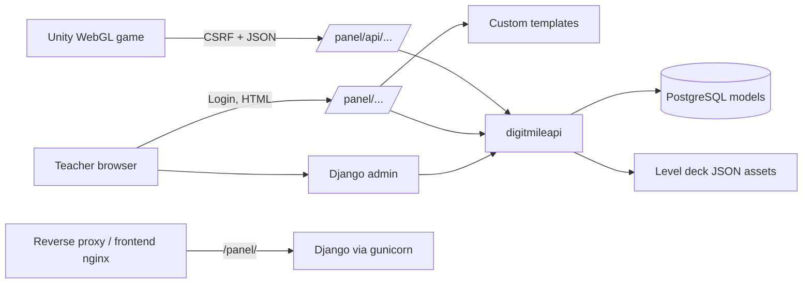
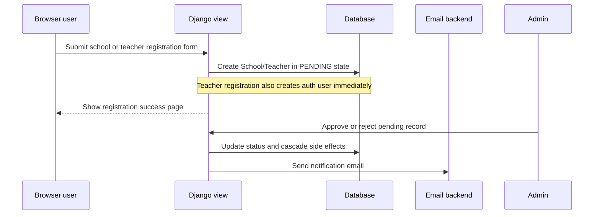
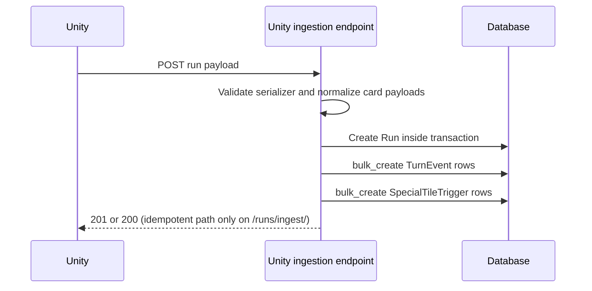

# Backend Architecture Overview

Last updated: 2026-03-09

## Why this subsystem exists

`DigitMilePanel/` is the Django backend for the DigitMile product. It does four jobs at once:

1. stores the organizational hierarchy (schools, teachers, classrooms, students),
2. accepts gameplay telemetry from the Unity client,
3. exposes teacher/admin APIs and HTML pages for operational use,
4. computes and presents teacher-facing analytics.

## High-level architecture

Core implementation boundaries:

- Project settings and root routing live in `DigitMilePanel/digitmile/`.
- Almost all business logic lives in `DigitMilePanel/digitmileapi/`.
- Static deck definitions used by analytics live in `DigitMilePanel/digitmileapi/templates/assets/Level1.json` through `Level6.json`.
- The backend expects to run behind the product nginx stack under `/panel/`.

## Major modules and responsibilities

### `digitmile/settings.py`

- Configures Django, DRF, captcha, CORS, WhiteNoise, email, i18n, and PostgreSQL.
- Sets `APPEND_SLASH = False`, so callers must hit exact paths.
- Does not define custom `REST_FRAMEWORK` or `CACHES` settings, so DRF and cache behavior are mostly framework defaults unless overridden by environment/runtime.

### `digitmile/urls.py`

- Mounts the whole backend under `/panel/`.
- Routes admin, registration pages, teacher dashboard pages, and the API namespace.

### `digitmileapi/models.py`

- Defines all stored domain entities.
- Uses prefixed string primary keys instead of integer IDs.
- Contains status transition side effects for `School` and `Teacher`.

### `digitmileapi/views.py`

- Handles Unity ingestion endpoints, registration views, approval workflows, teacher APIs, teacher dashboard pages, and run replay.
- Contains several analytics helper functions used only by the dashboard view.

### `digitmileapi/analytics.py`

- Houses reusable query helpers over the newer gameplay tables.
- Converts stored card payloads into card families, tile-conditional metrics, bag-conditional metrics, and per-level chart data.

### `digitmileapi/admin.py`

- Turns Django admin into the operational back office.
- Restricts teacher access to their own classrooms/students/runs.
- Implements soft-delete-style rejection messaging and classroom bulk student creation.

### `digitmileapi/apps.py`

- Uses `post_migrate` to create/update the `Teachers` auth group and assign model-level permissions.

## Runtime and deployment model

Evidence from `docker-compose.yml`, `DigitMilePanel/Dockerfile.compose`, and `DigitMilePanel/Dockerfile`:

- Database: PostgreSQL 16 container (`db`).
- Backend: Django served by gunicorn with 3 workers (`backend`).
- Static files: WhiteNoise inside Django.
- Frontend: Unity build served by a separate nginx container.
- Reverse proxy: optional `nginx-proxy` for localhost HTTPS and production-style routing.

Backend startup in compose currently runs:

1. `python manage.py migrate`
2. `python manage.py collectstatic --noinput`
3. `python manage.py create_superuser`
4. `gunicorn digitmile.wsgi:application --bind 0.0.0.0:8000 --workers 3`

## Primary execution flows

### School and teacher onboarding

### Unity gameplay ingestion

### Teacher dashboard loading

- Initial HTML request to `/panel/teacher/statistics/` computes per-student and per-classroom summary data synchronously in `teacher_statistics_dashboard`.
- Heavy chart datasets are fetched lazily from `/panel/teacher/statistics/viz-data/?section=...`.
- The chart endpoint caches each section for 5 minutes per teacher and filter combination via Django's default cache backend.

## Data flow boundaries

### Organizational data

- `School` <-many-to-many-with-extra-data-> `Teacher`
- `Teacher` -> `Classroom` -> `Student`

### Gameplay data

- Legacy path: `Student` -> `RunStatistics`
- Current path: `Student` -> `Run` -> `TurnEvent` -> `SpecialTileTrigger`

### UI-facing data

- Teacher admin pages read directly from models with queryset scoping.
- Teacher dashboard combines view-local summaries from `Run` data and lazy chart payloads from `RunAnalytics`.
- Run replay reads one `Run`, its `TurnEvent`s, and grouped `SpecialTileTrigger`s, then renders all replay logic client-side in the template JavaScript.

## Security and trust boundaries

- CSRF: Unity is expected to fetch `/panel/api/fetchCSRFToken/` and send the token in `X-CSRFToken`.
- CORS: `CORS_ALLOW_ALL_ORIGINS = True`, so origin-level protection is intentionally relaxed.
- Teacher access: enforced through the `Teachers` group plus teacher-profile status checks in views/admin.
- Rejection: implemented as access disablement, not hard deletion.
- Health endpoint: custom middleware short-circuits any request whose path contains `health` before normal processing.

## Evidence-backed implementation caveats

- `RunStatistics` still has API and admin surfaces, but the modern dashboard ignores it.
- `runs/ingest/` trusts `userID` and does not cross-check the submitted `classroomKey` or `user` against that student. It is idempotent: the same Unity payload always derives the same `Run.id`.
- Pending teachers are allowed to authenticate and access teacher functionality by design.
- Most card semantics are now clarified by gameplay canon in `CODEX.md` and your follow-up notes, but the backend still stores them as raw JSON-derived values rather than strict enums.

## Operational guidance

- Start debugging from the view layer in `DigitMilePanel/digitmileapi/views.py`, then verify serializer assumptions in `DigitMilePanel/digitmileapi/serializers.py` and model constraints in `DigitMilePanel/digitmileapi/models.py`.
- For dashboard discrepancies, verify whether the page uses precomputed summary data from `teacher_statistics_dashboard` or lazy section data from `RunAnalytics`.
- For permissions issues, inspect both auth-group membership and teacher profile status.

## Open questions / uncertainty notes

- The backend now has clarified canon for bag numbers, special-tile effects, and `wasCorrect`, but any deeper card-behavior disputes should still be checked against Unity because Django stores outcomes rather than enforcing all gameplay rules itself.
