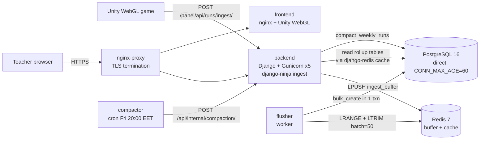

# System Architecture

Last updated: 2026-05-29

## What the system does

DigitMile is a Unity WebGL math game (`DigitMile/`) paired with a Django/PostgreSQL backend (`DigitMilePanel/`) that:

1. stores the organizational hierarchy (schools, teachers, classrooms, students),
2. accepts per-turn gameplay telemetry from the Unity client at scale,
3. exposes teacher/admin pages and APIs for operational use,
4. computes weekly per-student / per-classroom analytics and surfaces them to teachers,
5. archives raw gameplay rows to compressed JSONL on a weekly cadence to keep hot tables small.

Production target is a single 2 vCPU / 3.8 GiB VPS serving national-scale primary-school adoption (~60 000 grade 4–6 students in North Macedonia). The architecture is shaped by that constraint: read and write paths are deliberately decoupled so the cheap path (ingest) doesn't compete with the expensive path (dashboard reads) for the limited CPU budget.

## Service topology



Always-on services (`docker-compose.yml`):

| Service | Image | Role |
|---|---|---|
| `db` | `postgres:16-alpine` | Primary data store. Tuned for write throughput in `docker-compose.prod.yml` (`synchronous_commit=off`, raised `shared_buffers`). |
| `redis` | `redis:7-alpine` | Two roles: (a) ingest write buffer (Redis list `ingest_buffer`); (b) django-redis dashboard cache. AOF on, `appendfsync everysec`. |
| `backend` | `digitmile-backend` | Django 5.2 + django-ninja, Gunicorn 5 workers. Serves Unity ingest, teacher dashboard, admin, registration. |
| `flusher` | same image as `backend` | Long-running `python manage.py flush_ingest_buffer`. Drains the Redis buffer in batches into PostgreSQL. **Required for ingest to persist.** |
| `frontend` | `digitmile-game` | Static nginx serving the Unity WebGL build. |

Production-only services (`docker-compose.prod.yml`):

| Service | Image | Role |
|---|---|---|
| `nginx-proxy` | `digitmile-nginx-proxy` | TLS termination + path-based reverse proxy. Reloads every 6 h to pick up renewed certs. |
| `certbot` | `certbot/certbot` | Let's Encrypt webroot renewal loop (every 12 h). |
| `compactor` | `digitmile-compactor` | Tiny cron container; POSTs `/panel/api/internal/compaction/run-weekly/` on the configured cron schedule (Friday 20:00 Europe/Skopje by default). |

PgBouncer used to sit between `backend` and `db`. It was **removed from the production stack** after benchmarks on the target VPS showed its transaction-pool overhead exceeded its benefit once the Redis write buffer was in place. Django now connects directly to `db` with `CONN_MAX_AGE=60` and server-side cursors enabled. See `docs/thesis/chapter5_final.md` §5.3.2 for the measurement and `docs/decisions/thesis-benchmark-plan.md` §6 for the interpretation. The historical `no-pgbouncer.yml` overlay and the `before_pgbouncer_*` benchmark scenarios preserve the comparison.

## Request and data flows

### Ingest (Unity → backend → Redis → flusher → PostgreSQL)

```mermaid
sequenceDiagram
    participant Unity
    participant Ninja as django-ninja router<br/>/panel/api/runs/ingest/
    participant Redis
    participant Flusher
    participant DB as PostgreSQL

    Unity->>Ninja: POST run payload (~15.5 KB)
    Ninja->>Ninja: Pydantic v2 validation
    Ninja->>DB: Student.exists() check (sub-ms)
    Ninja->>Redis: LPUSH ingest_buffer
    Ninja-->>Unity: 202 Accepted
    Note over Redis,Flusher: ~100 ms loop, batch=50
    Flusher->>Redis: LRANGE 0..49 + LTRIM
    Flusher->>DB: Run.bulk_create + TurnEvent.bulk_create + SpecialTileTrigger.bulk_create (1 txn)
    Note over Flusher: On failure: RPUSH items back to tail<br/>(retry on next iteration; no loss)
```

Key properties:

- The HTTP path costs ~3 ms (Redis LPUSH) instead of ~50 ms (synchronous Postgres transaction). Backend CPU per request dropped accordingly; throughput is no longer bounded by per-request DB latency.
- `202 Accepted` means *validated and queued*, not *committed*. There is no client-facing endpoint that requires write-through confirmation; Unity does not depend on the row being visible.
- The flusher is a **hard runtime dependency**. If it stops, `ingest_buffer` grows without bound and persistence stalls. Monitor `LLEN ingest_buffer`. Redis AOF is configured `appendfsync everysec`, bounding loss to ~1 s of accepted writes on a hard crash — acceptable for game telemetry, not for transactional data.
- The ingest endpoint is idempotent: the same Unity payload always derives the same `Run.id`, and the flusher deduplicates within each batch and against already-persisted `Run` ids in one query.

See `docs/decisions/write-buffering-adr.md` for the full design rationale, and `docs/reference/ingestion-api.md` for the wire format.

### Dashboard read (teacher → backend → rollup tables → Redis cache → response)

The teacher dashboard reads **only** from precomputed rollup tables (`StudentWeekStats`, `StudentWeekLevelStats`, `StudentWeekCardFamilyStats`, `ClassroomWeekStats`, `StudentRunBucketTrend`, etc.) — never from raw `Run` / `TurnEvent` rows. This is the *rollup-only analytics* invariant.

Each dashboard endpoint goes through a django-redis cache with a 7-day TTL keyed by `teacher_dashboard:<teacher_id>:<section>:<filters>`. The cache is invalidated on every ingest for the affected teacher.

Why this matters: `TurnEvent` grows linearly with played turns (~60 000 rows per teacher per active week at medium adoption). Reading dashboards from raw rows would force a full scan per page load. Reading from `StudentWeek*` rollups bounds query cost at O(students × weeks displayed).

See `docs/reference/analytics-and-dashboard.md` for the full dashboard pipeline and `docs/thesis/diplomska-213031-ch4.md` §4 for the rollup math.

### Weekly compaction (compactor cron → backend → archive + delete)

Every Friday at 20:00 Europe/Skopje (configurable via `CRON_SCHEDULE`), the `compactor` container POSTs to `/panel/api/internal/compaction/run-weekly/` with the shared `INTERNAL_API_TOKEN`. The backend then runs `compact_weekly_runs` for the previous Mon–Sun week (which ended five days earlier — a deliberate buffer so teachers don't see mid-compaction state on Monday morning).

For each `(teacher, week)`:

1. Recompute and verify rollup tables match the raw rows (`rebuild_weekly_rollups` + `verify_weekly_rollups`).
2. Write a `ReplayArchive` row pointing at a gzipped JSONL file under `REPLAY_ARCHIVE_ROOT`.
3. Delete the raw `TurnEvent` and `SpecialTileTrigger` rows for that week. The `Run` row itself is retained with a `raw_data_compacted_at` timestamp.

The compactor container itself holds no database credentials and no application code — it only knows the token and the URL. The backend handles the actual compaction out of band, so the cron container's HTTP call is short (seconds), not a long-lived job. `MAX_WORKERS` caps backend concurrency for compaction work.

Operational details: `docs/guides/rollup-runbook.md`.

### Registration and admin

Synchronous Django views and admin pages. School registration uses an integrated Google Maps address picker; teacher registration triggers email approval workflows with CAPTCHA on submission. Approved teachers are added to the `Teachers` auth group and given scoped Django-admin access (they see only their own classrooms/students/runs). See `docs/reference/registration-and-admin.md`.

## Major code modules

### `digitmile/settings.py`

Django, DRF, django-ninja, captcha, CORS, WhiteNoise, email, i18n (mk/sq/en), PostgreSQL, django-redis cache, REDIS_URL, INGEST_BUFFER_REDIS_KEY, REPLAY_ARCHIVE_ROOT. `APPEND_SLASH = False`. `CACHES['default']` reads from `DJANGO_CACHE_BACKEND` env (defaults to `django_redis.cache.RedisCache`; the benchmark `dummy-cache.yml` overlay flips this).

### `digitmile/urls.py`

Mounts the entire backend under `/panel/`. Routes admin, registration pages, teacher dashboard pages, the legacy DRF API namespace, and the django-ninja `runs/ingest/` route.

### `digitmileapi/ingest_router.py`

Canonical Unity ingest endpoint (`POST /panel/api/runs/ingest/`). django-ninja + Pydantic v2 validation. Performs validation → student existence check → idempotency check → recording-window check → `LPUSH ingest_buffer` → `202 Accepted`. Reads `settings.REDIS_URL` directly (not via the cache backend) so the benchmark `dummy-cache.yml` overlay doesn't break ingest.

### `digitmileapi/management/commands/flush_ingest_buffer.py`

Long-running flusher loop. `LRANGE`/`LTRIM` pipeline pops `INGEST_BUFFER_BATCH_SIZE` items, deduplicates within the batch + against persisted `Run` ids, then `bulk_create` for `Run` / `TurnEvent` / `SpecialTileTrigger` in one `transaction.atomic()`. On exception, `RPUSH` items back to the queue tail.

### `digitmileapi/management/commands/compact_weekly_runs.py`

Per-(teacher, week) compaction worker. Called from the internal HTTP trigger fired by the compactor cron.

### `digitmileapi/management/commands/rebuild_weekly_rollups.py`, `weekly_aggregation.py`, `weekly_rollups.py`

Two paths to rollup state: **incremental** (run on every flusher batch via `rollup_incremental.py`) and **batch** (full week recompute via `weekly_aggregation.py`). They are required to converge — the rebuild command is the idempotency guarantee. See `docs/guides/rollup-runbook.md`.

### `digitmileapi/models.py`

All stored entities. Prefixed string primary keys (`tch_*`, `cls_*`, `stu_*`, `run_*`, etc.) instead of integer IDs for cross-table safety. Status transition side effects for `School` and `Teacher`. `WeeklyCompactionRun` tracks per-(teacher, week) compaction state; `ReplayArchive` points at archived raw rows.

### `digitmileapi/views.py` and `digitmileapi/analytics.py`

`views.py` — registration views, approval workflows, teacher dashboard pages, run replay viewer, legacy DRF API. `analytics.py` — reusable rollup-querying helpers used by the dashboard.

### `digitmileapi/admin.py`

Django admin as the operational back office. Restricts teacher access to their own classrooms/students/runs. Soft-delete-style rejection messaging.

### `digitmileapi/apps.py`

`post_migrate` signal creates/updates the `Teachers` auth group with the right model-level permissions.

## Configuration & environment

- All env vars read by the backend: `docs/reference/configuration.md`.
- Notable for architecture: `DB_HOST=db` (direct, no pooler), `DB_CONN_MAX_AGE=60`, `REDIS_URL=redis://redis:6379/1`, `INGEST_BUFFER_BATCH_SIZE=50`, `INGEST_BUFFER_SLEEP_MS=100`, `INTERNAL_API_TOKEN` (shared between backend and compactor).

## Security and trust boundaries

- **CSRF.** Unity fetches `/panel/api/fetchCSRFToken/` once per browser session and sends the token in `X-CSRFToken`. Only the token-fetch endpoint bypasses CSRF.
- **CORS.** `CORS_ALLOW_ALL_ORIGINS = True` — intentionally permissive for Unity WebGL builds that may be embedded across origins.
- **Internal endpoints.** `/panel/api/internal/compaction/...` requires the `INTERNAL_API_TOKEN` shared header. Used by the compactor; not exposed to teachers or to the public internet (the reverse proxy could be locked down further if needed).
- **Teacher auth.** `Teachers` auth group + teacher-profile status checks in views/admin. Rejection disables access; data is not hard-deleted (audit trail).
- **Health.** Custom `HealthCheckMiddleware` short-circuits any request whose path contains `health` before normal processing — keeps liveness probes simple.

## Observability

Logs go to stdout per container; consume with `docker compose logs -f <service>`. Structured `logger.info/.warning/.exception` calls on the ingest, flusher, and compaction paths.

Key signals:

- `LLEN ingest_buffer` — should stay near 0 in steady state. Sustained growth = flusher problem.
- Flusher container CPU + memory — should track ingest rate.
- `WeeklyCompactionRun` rows — terminal `status` field tells you whether the last Friday's job succeeded.
- `/panel/health/` — always-200 even when DB is unhealthy; use it for liveness, not readiness.

## Performance reference

All five non-functional requirements from the thesis pass with significant margin on the production-target hardware (2 vCPU / 3.8 GiB). Cumulative effect of all shipped optimizations: average HTTP latency 22 683 ms → 29 ms (-99.9%); drops 920 → 0. Detailed pass/fail per NFR and per-optimization marginal contributions are in `docs/thesis/chapter5_final.md`; raw reports in `benchmarks/server_reports/`.

## Operational caveats

- Legacy DRF ingest routes (`insertRunData/`, etc.) still exist on the URL conf but the canonical Unity path is `runs/ingest/`. New work targets the ninja router.
- `RunStatistics` model and its admin surface remain but the modern dashboard does not read from it.
- Pending teachers are allowed to authenticate by design — registration is two-step.
- The `k8s/` directory is **outdated scaffolding**, not a live deploy path. The docker-compose flow is the only path in production.

## Related documents

- `docs/decisions/write-buffering-adr.md` — design rationale for the Redis write buffer (optimization F).
- `docs/research/ingest-capacity-model.md` — canonical CCU/RPS formula. Source for `national_medium` / `national_high` benchmark targets.
- `docs/thesis/chapter5_final.md` — full empirical evaluation of the six optimizations and NFR closures.
- `docs/decisions/thesis-benchmark-plan.md` — methodology and toggle harness reference.
- `docs/reference/data-model.md`, `docs/reference/ingestion-api.md`, `docs/reference/analytics-and-dashboard.md` — code-level reference.
- `docs/guides/deployment.md`, `docs/guides/operations.md`, `docs/guides/rollup-runbook.md` — operational procedures.
