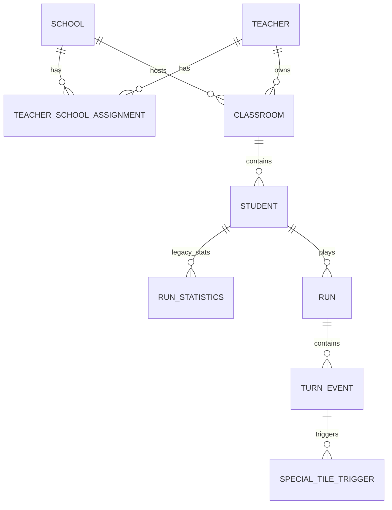

# Backend Data Model

Last updated: 2026-03-09

## Why this subsystem exists

The data model stores both the human side of the product (schools, teachers, classrooms, students) and the gameplay side (runs, turns, card choices, special-tile chains). It is the backbone for registration, authorization scoping, analytics, and replay.

## Entity map

## ID strategy

Every model uses a prefixed string primary key rather than an auto-increment integer.

- `School`: `sch_<12 hex>`
- `Teacher`: `tch_<12 hex>`
- `TeacherSchoolAssignment`: `tsa_<12 hex>`
- `Classroom`: `cls_<12 hex>`
- `Student`: `stu_<12 hex>`
- `RunStatistics`: `rst_<12 hex>`
- `Run`: `run_<32 hex>`
- `TurnEvent`: `trn_<12 hex>`
- `SpecialTileTrigger`: `stt_<12 hex>`

`Run` intentionally uses a longer full UUID-sized suffix because the newer ingestion path supports idempotency.

## Core organizational entities

### School

Stored in `DigitMilePanel/digitmileapi/models.py` as `School`.

Purpose:

- Represents a registered school or institution.
- Acts as a teacher assignment target and optional classroom host.

Key fields:

- Identity/location: `name`, `municipality`, `region`, `address`, `latitude`, `longitude`, `google_maps_address`, `website`
- Registration contact: `contact_person_name`, `contact_person_email`, `contact_person_phone`
- Official school contact: `director_name`, `director_email`, `school_email`, `school_phone`
- Lifecycle: `status`, `created_at`, `updated_at`

Relationships:

- many-to-many with `Teacher` through `TeacherSchoolAssignment`
- one-to-many to `Classroom`

Database constraints and invariants:

- `unique_together = (name, municipality, region)`
- School registration form additionally blocks duplicates by `(address, school_email, director_name)` for `PENDING` and `APPROVED` records.

Lifecycle states:

- `PENDING`: newly submitted school, awaiting admin review
- `APPROVED`: active school
- `REJECTED`: kept for audit/history, but effectively inactive

State side effects:

- When an existing school transitions to `REJECTED`, `School.save()` finds teachers assigned to that school.
- Any teacher whose only school is the rejected school is also marked `REJECTED` and their linked Django user is deactivated.
- No classrooms, students, or gameplay data are deleted.

Important nuance:

- There is no automatic reverse transition behavior for schools similar to teacher re-approval; re-approving a school just changes its status and leaves teacher recovery to manual/admin flows.

### Teacher

Stored as `Teacher`.

Purpose:

- Represents a teacher profile and its link to Django auth.
- Owns classrooms and gains scoped access to students/runs.

Key fields:

- Identity: `full_name`, `email`, `phone_number`
- Experience: `years_teaching`
- Auth link: `user` (nullable one-to-one to `auth.User`)
- Lifecycle: `status`, `created_at`, `updated_at`

Relationships:

- many-to-many with `School` through `TeacherSchoolAssignment`
- one-to-many to `Classroom`
- one-to-one to Django `User`

Database constraints and invariants:

- `email` is globally unique at the database level.
- `primary_school` is only a convenience property that returns the first approved school.

Lifecycle states:

- `PENDING`: teacher can still have a user account and, in current code, can still log in
- `APPROVED`: active teacher
- `REJECTED`: access disabled but records preserved

State side effects:

- Transition to `REJECTED`: deactivate linked `User.is_active`
- Transition from `REJECTED` to `APPROVED`: reactivate linked user if present

Important nuance:

- The registration flow creates a Django staff user immediately, even before approval.
- Permission checks in `IsTeacher` and the teacher dashboard explicitly allow both `PENDING` and `APPROVED` teachers.
- This means "pending" currently means "awaiting admin review" rather than "blocked from use".

### TeacherSchoolAssignment

Stored as the explicit through model between teacher and school.

Purpose:

- Captures which schools a teacher belongs to and how many years they have been at each school.

Key fields:

- `teacher`
- `school`
- `years_at_school`

Constraint:

- `unique_together = (teacher, school)`

State model:

- No explicit status.
- Effective usability depends on the statuses of the linked teacher and school.

### Classroom

Purpose:

- Groups students under one teacher, optionally under one school, and provides the classroom access key used by the Unity client.

Key fields:

- `classroom_key` - unique gameplay/bootstrap key
- `classroom_name`
- `grade`
- `teacher`
- `school` (nullable)

Relationships:

- many classrooms per teacher
- many classrooms per school
- one classroom to many students

Constraints and validation:

- `classroom_key` is globally unique by field definition.
- `unique_together = (classroom_key, school)` is redundant with the global uniqueness of `classroom_key`.
- `clean()` enforces that a classroom's teacher must be assigned to the selected school.

Operational state categories:

- assigned to approved school
- assigned to pending school
- school omitted (`NULL`)

Important nuance:

- Teacher admin flows only expose schools assigned to that teacher and exclude rejected schools.

### Student

Purpose:

- Represents an individual player/student.

Key fields:

- `full_name`
- `date_of_birth`
- `grade`
- `classroom`

Constraint:

- `unique_together = (full_name, classroom)`

Operational state categories (derived, not explicit):

- rostered but no gameplay
- legacy-only gameplay (`RunStatistics` exists)
- modern gameplay (`Run` exists)
- both legacy and modern gameplay

Important nuance:

- `CheckStudentCredentialsView` looks up students only by `full_name + date_of_birth`, not by classroom. If two classrooms contain students with the same name and birth date, the endpoint can return `409 MultipleObjectsReturned`.

## Gameplay entities

### RunStatistics (legacy)

Purpose:

- Stores one coarse-grained legacy gameplay record per student attempt.
- Predates the newer run/turn/triggers schema.

Key fields:

- `student`
- `player_won`
- `level`
- `score`
- `place`
- `correct_moves`
- `wrong_moves`
- `time_elapsed`
- timestamps

Current role:

- Still written by `insertLevelStatistics/`
- Still exposed by `TeacherRunStatisticsListView`
- Still visible in admin
- Not used by the main teacher dashboard analytics

Lifecycle state categories:

- win vs loss (`player_won`)
- no explicit validation tying it to turn-level evidence

### Run (current primary gameplay record)

Purpose:

- Represents one complete game session for a student.
- Parent record for replay and modern analytics.

Key fields:

- Identity/scope: `id`, `student`, `level`
- Outcome: `player_won`, `score`, `place`
- Timing: `elapsed_ms`, timestamps
- Performance counts: `correct_moves`, `wrong_moves`
- Reproducibility/context: `game_map`, `map_version`, `bot_version`, `rng_seed`

Indexes:

- `(student, created_at)`
- `(student, level)`
- `(level, created_at)`

Lifecycle categories:

- won vs lost
- ranked by final `place`
- replayable if `game_map` and `turn_events` are present

Important nuances:

- `InsertRunDataView` populates `place` and `game_map` from Unity.
- `RunIngestionView` relies on model defaults, so `place` defaults to `4` and `game_map` defaults to `[]` on that path.
- That makes the two ingestion endpoints structurally similar but not equivalent.

### TurnEvent

Purpose:

- Captures one turn inside a run, including the cards offered, the chosen card, whether the move was correct, position changes, bag-number decisions, and bot context.

Key fields:

- identity/order: `run`, `turn_index`, `timestamp_played`
- card choice: `chosen_card`, `chosen_card_type`, `chosen_card_family`, `chosen_card_tile_type`, `offered_cards`
- correctness and board context: `was_correct`, `tile_before_index`, `tile_before_type`, `tile_after_index`, `place_before`, `place_after`
- bot state: `bot_positions_before`, `bot_positions_after`
- timing: `card_decision_time_ms`
- number mechanic: `offered_numbers`, `chosen_number`, `number_decision_time_ms`

Constraints and indexes:

- unique `(run, turn_index)`
- index on `(run, turn_index)`
- index on `(run, timestamp_played)`
- indexed card metadata fields for analytics filtering

State categories:

- correct vs wrong (`was_correct`), where `was_correct=True` means the player clicked the exact tile implied by the chosen card's movement logic
- bag-number turn vs normal turn (`chosen_number is not null`)
- special-tile turn vs normal turn (`special_tile_triggers.exists()`)
- conditional card vs plain card (`chosen_card_family`)

Important nuances:

- Card family metadata was added later in migration `0004`; older rows are backfilled from the raw `chosen_card` JSON.
- Unity upload paths often treat `tileIndex` as tile type when persisting `tile_before_type` and trigger tile types.

### SpecialTileTrigger

Purpose:

- Represents one special tile effect inside a turn.
- Multiple triggers may chain off the same turn.

Key fields:

- `turn`
- `chain_index`
- `special_tile_index`
- `special_tile_type`
- `effect_delta_tiles`
- `target_tile_index`
- `target_tile_type`
- `place_before`
- `place_after`

Constraints and indexes:

- unique `(turn, chain_index)`
- indexes on `(turn, chain_index)`, `special_tile_index`, `special_tile_type`

State categories:

- first/second/etc trigger in chain
- positive movement vs negative movement (`effect_delta_tiles`)

Inferred semantics from code:

- tile type `4` is treated as clown / backward special tile
- tile type `5` is treated as skateboard / forward special tile
- gameplay canon supplied by you says clown is `-4` and skateboard is `+5`

## Relationship and lifecycle rules that matter in practice

### School/teacher rejection is soft-state, not deletion

- Rejecting a school or teacher preserves all classrooms, students, and game history.
- Access changes happen by status and `User.is_active`, not by record removal.

### Teacher work can start before school approval

- Teachers can be assigned to pending schools.
- `TeacherSchoolView` returns both pending and approved schools, excluding only rejected ones.
- Admin forms allow teachers to work with non-rejected assigned schools.

### Legacy and current gameplay records coexist per student

- A student may have both `RunStatistics` and `Run` rows.
- Only the newer path supports replay and turn-level analytics.

## Stored gameplay semantics and inferred states

These are not formal enums, but the backend relies on them:

- `player_won`: inferred win/loss flag at run level
- `place`: 1 means first place; many flows treat `place == 1` as win
- `chosen_card_family` values currently used by analytics:
  - `move`
  - `back`
  - `conditional_tile`
  - `conditional_bag_eq`
  - `conditional_bag_lt`
  - `conditional_bag_gt`
  - `bagcount`
  - `foreach_tile`
  - `unknown`
- number-choice mechanics appear to apply only in levels 5 and 6 in current UI/seed logic
- bag number for a turn means the number chosen at the end of the previous turn; the first turn defaults to `1`
- back-card usage is only surfaced in the dashboard for level 6

## Evidence-backed mismatches and risks

- `TeacherRegistrationForm` allows re-registration if an older teacher is `REJECTED`, but the model-level unique `email` constraint still blocks duplicate emails. The form and database rule are not fully aligned.
- The school registration form enforces one duplicate rule, while the model enforces a different uniqueness rule.
- `Classroom.__str__()` assumes `school` is present and would fail if a classroom with `school=None` is stringified.
- The backend still mixes formal model fields with Unity-derived semantics, so gameplay changes should be reviewed against ingestion, analytics, replay, and seed logic together.

## Operational guidance

- Any schema change touching gameplay data should be reviewed against `analytics.py`, replay rendering in `teacher_run_replay.html`, and both ingestion endpoints.
- Any change to school/teacher status handling must be checked against `models.py`, approval/rejection views, and admin save hooks.

## Open questions / uncertainty notes

- Bag-number semantics and `wasCorrect` semantics are now clarified. Remaining ambiguity is mainly around Unity-only concepts that are stored as telemetry rather than enforced by Django.
