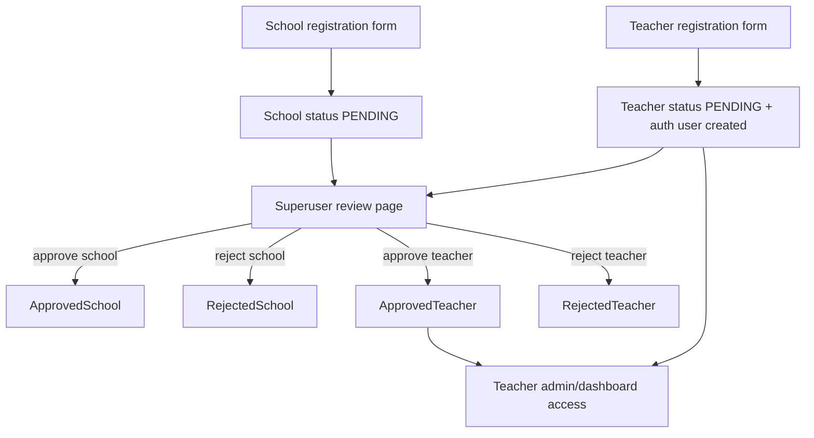

# Backend Registration and Admin Workflows

Last updated: 2026-03-09

## Why this subsystem exists

This part of the backend handles onboarding of schools and teachers, review/approval by administrators, and daily teacher operations inside a customized Django admin surface.

## High-level workflow map

## School registration flow

### Why it exists

Schools must exist before teachers can associate themselves with those institutions.

### Form and template

- form class: `SchoolRegistrationForm`
- view: `register_school_view`
- template: `DigitMilePanel/digitmileapi/templates/digitmileapi/register_school.html`

### Captured data

- school identity and contact fields
- location fields (`address`, `latitude`, `longitude`, `google_maps_address`)
- contact-person fields for the submitter
- official school fields (director and school email/phone)
- captcha

### Template population and client behavior

- view passes `form`
- view passes `google_maps_api_key`
- template loads Google Maps Places API
- autocomplete and draggable marker populate:
  - `id_latitude`
  - `id_longitude`
  - `id_google_maps_address`
- template also attempts to prefill `name`, `address`, `municipality`, and `region` from Google place data

### Validation

The form blocks duplicates when the same `(address, school_email, director_name)` already exists in `PENDING` or `APPROVED` state.

### Persistence behavior

- `register_school_view` always forces `status = "PENDING"`
- on success it redirects to `registration_success`

## Teacher registration flow

### Why it exists

Teachers self-register and select up to three schools they work with.

### Form and template

- form class: `TeacherRegistrationForm`
- view: `register_teacher_view`
- template: `DigitMilePanel/digitmileapi/templates/digitmileapi/register_teacher.html`

### Captured data

- `full_name`
- `email`
- `years_teaching`
- `phone_number`
- selected schools (1 to 3)
- per-school `years_at_school_<school_id>` fields injected by the template
- captcha

### Template population and client behavior

- template iterates `form.schools.field.queryset`
- the queryset contains schools in `PENDING` or `APPROVED` state, ordered by status then name
- pending schools are visibly labeled as pending
- front-end JavaScript:
  - enforces 1-to-3 school selection in the browser
  - shows the matching years-at-school input when a checkbox is checked

### Server-side validation

- at least one school required
- at most three schools allowed
- form-level duplicate check only flags matching `email + full_name` for `PENDING` and `APPROVED` teachers

### Persistence behavior

`register_teacher_view` does all of the following immediately:

1. creates `Teacher(status="PENDING")`
2. creates one `TeacherSchoolAssignment` per selected school
3. creates a Django `User` with:
   - username = email prefix
   - random 12-character password
   - `is_staff=True`
4. gets or creates the `Teachers` group and adds the user to it
5. links `teacher.user`
6. sends the registration email containing credentials

### Most important implementation truth

Pending teachers are not blocked from using the system. They receive credentials right away, and later permission checks allow `PENDING` teachers to log in and operate.

## Approval and rejection workflows

### Review page

- route: `/panel/api/pending-registrations/`
- view: `pending_registrations_view`
- access: superuser only

The page loads:

- pending schools
- pending teachers
- case-insensitive "similar email" warnings for each row

`find_similar_emails()` only flags same email with different letter case and only among `PENDING` or `APPROVED` records.

### Approve school

View: `approve_school`

Behavior:

- loads only `School(status="PENDING")`
- sets status to `APPROVED`
- saves school
- sends school approval email to `contact_person_email`

### Reject school

View: `reject_school`

Behavior:

- loads only `School(status="PENDING")`
- inspects all assigned teachers
- identifies teachers whose only school is this school
- sets school status to `REJECTED`
- relies on `School.save()` to reject those single-school teachers and deactivate their users
- preserves all associated data

### Approve teacher

View: `approve_teacher`

Two branches exist:

#### If `teacher.user` already exists

- set teacher status to `APPROVED`
- keep existing credentials
- send approval notification email without credentials

#### If `teacher.user` does not exist

- create a staff `User`
- add to `Teachers` group
- link to teacher
- set status to `APPROVED`
- send approval email with credentials

### Reject teacher

View: `reject_teacher`

Behavior:

- loads only `Teacher(status="PENDING")`
- sets status to `REJECTED`
- `Teacher.save()` deactivates the linked user if present
- preserves classrooms, students, runs, and analytics

## Teacher auth and permission model

### Group provisioning

`DigitMilePanel/digitmileapi/apps.py` hooks `post_migrate` and ensures a `Teachers` group exists.

Model-level permissions granted to that group:

- `view/add/change/delete_student`
- `view/add/change/delete_classroom`
- `view_school`
- `view_run`
- `view_turnevent`
- `view_specialtiletrigger`

### Runtime permission checks

`IsTeacher` requires all of:

- authenticated user
- membership in `Teachers` group
- linked `teacher_profile`
- teacher status in `PENDING` or `APPROVED`

So access is explicitly denied only for rejected teachers.

## Django admin customizations

## Why this matters

Most teacher operations happen through Django admin rather than a separate SPA.

### School admin

- superusers see all schools
- teachers can view only their assigned approved schools, effectively read-only
- changing a school to `REJECTED` shows warning messages about cascaded teacher rejection

### Teacher admin

- superusers manage teachers directly
- admin messages explain what happens on reject and re-approve
- re-approving a rejected teacher from admin can create a new user if missing and attempt a password reset email

### Classroom admin

- teachers see only their own classrooms
- when teachers add/edit a classroom, the form auto-assigns `teacher = request.user.teacher_profile`
- teachers can choose only from their own non-rejected schools
- includes `bulk_students` textarea to create many students in one save

Bulk student input format:

- `FullName/YYYY-MM-DD, Another Student/2015-03-15`

On save:

- duplicate student names in the same classroom are skipped
- student `grade` is copied from classroom grade

### Student admin

- teachers see only students in their own classrooms
- classroom choices are restricted to the teacher's classrooms
- a save-time permission check prevents assigning students outside the teacher's classrooms

### Run and replay admin

- teachers can view runs, turns, and triggers belonging to their own students
- runs are read-only for teachers
- `RunAdmin` exposes a replay button that links to `/panel/teacher/runs/<run_id>/`

### Legacy run statistics admin

- visible only to superusers (`has_module_permission` and `has_view_permission` both require superuser)
- this reinforces that legacy stats are operationally secondary now

## Templates and population details for onboarding/admin flows

### `home.html`

- acts as both landing page and login form
- explains the teacher/school onboarding sequence
- redirects authenticated users to `/panel/admin/`

### `registration_success.html`

- plain confirmation page after either school or teacher registration

### `pending_registrations.html`

- receives `schools_with_warnings` and `teachers_with_warnings`
- each warning bundle contains the object plus similar-email matches

## Email flows

Defined in `views.py` helper functions.

### School approval email

- sent to school contact person
- announces that teachers can now register

### Teacher registration email

- sent immediately after teacher self-registration
- contains username/password even while teacher is pending

### Teacher approval email

- sent only in the branch where approval required creating a user account at approval time

### Teacher approval notification for already-provisioned users

- sent when a pending teacher already had credentials from registration

Operational note:

- if `EMAIL_BACKEND` is the console backend, the system logs a warning that mail was printed but not actually delivered

## Evidence-backed implementation caveats

- Teacher username generation in `register_teacher_view` does not handle collisions on email prefix. `john@example.com` and `john@school.mk` would both try `username='john'`.
- The form-level duplicate rule for teachers is weaker than the model-level unique email constraint.
- Approval/rejection routes are exposed as GET actions rather than POST actions.
- Pending teachers and teachers attached to pending schools can still work in the system before final approval.

## Operational guidance

- Any change to teacher registration should be validated across form validation, user creation, email sending, `IsTeacher`, and admin group provisioning.
- If you want pending teachers to be blocked, you must change both registration behavior and every permission check that currently allows `PENDING`.
- If you tighten school approval rules, revisit classroom creation and school visibility in both admin and API endpoints.

## Open questions / uncertainty notes

- The product intent behind allowing pending teachers to log in immediately may be deliberate, but the codebase does not document the business rule beyond comments and implementation.
