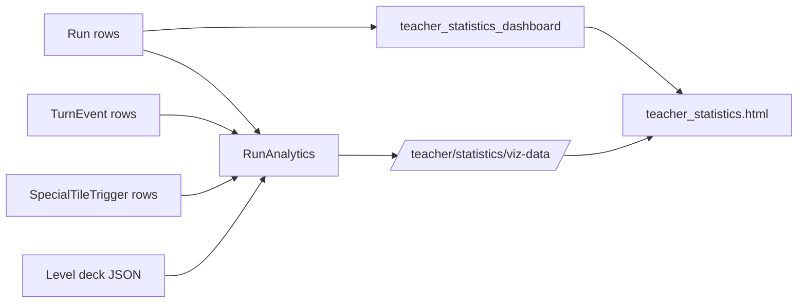

# Backend Analytics and Teacher Dashboard

Last updated: 2026-03-09

## Why this subsystem exists

The analytics layer turns raw run and turn telemetry into teacher-facing summaries, charts, rankings, replay context, and intervention signals. It is split across reusable query helpers in `DigitMilePanel/digitmileapi/analytics.py` and dashboard-specific rollups inside `teacher_statistics_dashboard` in `DigitMilePanel/digitmileapi/views.py`.

## High-level architecture

- Primary analytics source of truth: `Run`, `TurnEvent`, `SpecialTileTrigger`
- Legacy analytics still present: `RunStatistics`
- Query helpers: `RunAnalytics`
- Dashboard page: `teacher_statistics_dashboard`
- Lazy chart data endpoint: `teacher_statistics_viz_data`
- Frontend rendering: `teacher_statistics.html` with Chart.js

## Scope filtering model

Most query helpers use `_apply_scope_filters()` in `analytics.py`.

Supported scopes:

- teacher-wide
- classroom-specific
- explicit `student_ids`

Important behavior:

- when `student_ids=[]`, the helper returns `queryset.none()` to avoid accidental full-table scans

## Card and gameplay normalization used by analytics

Analytics does not rely only on raw `chosen_card` JSON. It uses these derived concepts:

- normalized card type: collapses `Bug`, `Back`, and `AllBack*` into `Back`
- card family:
  - `move`
  - `conditional_tile`
  - `conditional_bag_eq`
  - `conditional_bag_lt`
  - `conditional_bag_gt`
  - `bagcount`
  - `foreach_tile`
  - `back`
  - `unknown`
- parsed card data fields:
  - `tile_type`
  - `if_sign`
  - `if_value`
  - `then_value`
  - `else_value`

Deck expectations come from `digitmileapi/templates/assets/Level1.json` through `Level6.json`.

## Statistics catalog

### Run-level overview metrics

| Metric | Source | Meaning | Current consumer |
| --- | --- | --- | --- |
| `win_rate_by_level` | `Run` | `wins / total_runs * 100` by level | analytics charts |
| `avg_score_by_level` | `Run` | average/min/max score by level | helper exists, not used by current dashboard template |
| `wrong_moves_rate_by_level` | `Run` | total correct, total wrong, and wrong-rate by level | analytics chart labeled "Accuracy by Level" uses totals, not wrong-rate |
| `time_distribution_by_level` | `Run` | avg/min/max/stddev elapsed time by level | analytics charts |
| `speed_vs_accuracy_scatter` | `Run` | per-run elapsed seconds vs accuracy | analytics charts |
| `student_performance_summary` | `Run` + `TurnEvent` | single-student aggregate summary | helper exists, not used directly in dashboard |
| `classroom_leaderboard` | `Run` | top students by chosen metric | helper exists, not used directly in dashboard |

Important nuance:

- The dashboard's "Accuracy by Level" chart is not actually plotting a calculated accuracy percentage. It stacks `total_correct` and `total_wrong` from `wrong_moves_rate_by_level`.

### Turn-location and board-state metrics

| Metric | Source | Meaning |
| --- | --- | --- |
| `mistake_hotspots_by_level` | wrong `TurnEvent` rows | wrong-turn counts grouped by `tile_before_index` and level |
| `special_tile_breakdown` | `SpecialTileTrigger` | trigger counts by level and special tile type |
| `special_tile_chain_length_distribution_by_level` | `TurnEvent` + `SpecialTileTrigger` | how many turns have 0, 1, 2, ... chained triggers |

Interpreted tile semantics from code:

- tile type `5` -> skateboard
- tile type `4` -> clown

Gameplay canon clarified by you:

- clown tile is a penalty tile that moves the player `4` tiles backward
- skateboard tile is a reward tile that should move the player `5` tiles forward

### Decision-time metrics

| Metric | Source | Meaning |
| --- | --- | --- |
| `avg_card_decision_time_by_level` | `TurnEvent` | average card decision time per level |
| `decision_time_by_card_type` | `TurnEvent` | decision-time distribution per concrete card type |
| `decision_time_by_family_by_level` | `TurnEvent` | decision-time distribution per card family and level |
| `number_decision_time_by_choice_by_level` | `TurnEvent` | average number-choice time by chosen number and level |

These helpers often return richer stats than the UI currently shows. For example, `decision_time_by_card_type` returns count/min/max/median/quartiles, but the dashboard charts only the average.

### Card exposure, usage, and adoption metrics

| Metric | Source | Meaning |
| --- | --- | --- |
| `deck_expected_share_by_family` | deck JSON | expected share of each card family in the designed deck per level |
| `offer_choice_share_by_family` | `TurnEvent` + offered cards | how often a family is offered vs chosen by level |
| `card_exposure_vs_adoption_by_family` | `TurnEvent` | aggregate offered-vs-chosen family counts across scope |

What these represent:

- `offered_share`: percent of all offered-card slots belonging to a family
- `chosen_share`: percent of all chosen cards belonging to a family
- `choice_rate`: `chosen / offered * 100` for that family
- `expected_share`: design-time family proportion from the deck asset file

### Card accuracy metrics

| Metric | Source | Meaning |
| --- | --- | --- |
| `card_accuracy_by_family` | `TurnEvent` | aggregate correct/wrong rates by family |
| `card_accuracy_by_family_by_level` | `TurnEvent` | same, split by level |

These metrics treat Unity's `was_correct` as the ground truth. You clarified that this flag means the player chose a card, reasoned about the number of spaces it should move them, and then clicked the correct tile exactly that many spaces away.

### Conditional-card metrics

#### Tile-conditional cards

Helpers:

- `tile_conditional_accuracy_by_tile_type`
- `tile_conditional_accuracy_by_tile_type_by_level`

What they measure:

- accuracy for `conditional_tile` cards grouped by the target `tile_type`
- else-branch rate, inferred when `tile_before_type != chosen_card_tile_type`

Meaning of else rate here:

- percent of tile-conditional turns where the card's tile-condition was not met, so the card would have taken its else branch

#### Bag-conditional cards

Helpers:

- `bag_conditional_accuracy_by_comparator`
- `bag_conditional_accuracy_by_comparator_by_level`

Comparators:

- `eq`
- `lt`
- `gt`

How bag state is reconstructed:

- bag number starts at `1` for each run
- before each turn, analytics remembers the current bag number
- if a turn has `chosen_number`, that chosen number becomes the next bag number
- this matches your clarification that the active bag number is effectively the number picked at the end of the previous turn

Meaning of else rate here:

- percent of bag-conditional turns where the comparator was not satisfied, so the card would have taken its else branch

Combined helper:

- `conditional_else_branch_rates` returns overall tile vs bag else rates

### Back card and foreach context metrics

| Metric | Source | Meaning |
| --- | --- | --- |
| `back_card_usage_by_place` / `..._by_level` | `TurnEvent` | how often back cards are used from each place standing |
| `foreach_tile_context_usage` / `..._by_level` | `TurnEvent` + `Run.game_map` + bot positions | whether `ForXMoveY` was used when an opponent was already on the target tile type |

The foreach context helper builds a map cache from each run's stored `game_map`, then checks bot positions against the chosen card's target tile type.

### Number-choice metrics

| Metric | Source | Meaning |
| --- | --- | --- |
| `number_choice_distribution` / `..._by_level` | `TurnEvent` | how often each bag number is chosen |
| `number_decision_time_by_choice` / `..._by_level` | `TurnEvent` | average selection time for each chosen number |

These are only meaningful when the game uses number selection; your clarification and `CODEX.md` both align that this mechanic is introduced in levels 5 and 6, and the dashboard template also exposes them only there.

## Dashboard-computed student metrics

The main dashboard view computes a second layer of teacher-facing metrics directly in `teacher_statistics_dashboard`.

For each student with at least one `Run`, it builds:

- `total_runs`
- `wins`
- `win_rate`
- `latest_run_id`, `latest_run_level`, `latest_run_created_at`
- `accuracy` = total correct / total moves * 100 across all runs
- `avg_score` = recency-weighted average score
- `avg_decision_time` = total elapsed seconds / total moves
- `improvement_rate`
- `consistency`
- `learning_curve_slope`
- `learning_curve_trend`
- `level_performance` breakdown
- raw series for scores, times, correct moves, wrong moves, per-game accuracy

### Important nuance: `avg_decision_time`

The dashboard's per-student `avg_decision_time` is not the same as `TurnEvent.card_decision_time_ms`.

It is computed as:

- total run elapsed seconds across all runs
- divided by total moves (`correct + wrong`)

So it is better understood as average time-per-move, not literal card-choice time.

### Recency weighting

`calculate_weighted_metric()` gives heavier weights to newer records:

- <= 30 days old -> weight `3.0`
- <= 90 days old -> weight `2.0`
- <= 180 days old -> weight `1.5`
- older -> weight `1.0`

If timestamps are missing, it falls back to linear positional weighting.

### Improvement rate

- requires at least 7 accuracy observations
- compares average of an initial sample window vs a recent sample window
- returns percentage improvement over the initial average

### Learning curve slope and trend labels

`calculate_learning_curve_slope()` uses a simple least-squares line over the metric sequence.

Trend classification:

- slope > `0.05` -> `improving`
- slope < `-0.05` -> `declining`
- otherwise:
  - average performance > `80` -> `mastered`
  - else -> `plateaued`
- fewer than 7 values -> `insufficient_data`

### Consistency score

`calculate_consistency_score(values)` computes:

- `1 - (std_dev / mean)`
- clamped to `[0, 1]`

Interpretation encoded in comments:

- `1.0` = perfectly consistent
- `< 0.7` = highly variable

### Attention and reward heuristics

Students needing attention if either:

- learning trend is `declining`, or
- wrong-move ratio > `0.5`

Students ready for rewards if any of:

- trend is `improving` and slope > `0.1`
- overall accuracy >= `90`
- consistency > `0.85` and weighted average score > `0`

These are heuristic flags, not persisted model states.

## Classroom summary metrics on the dashboard

For each classroom in scope, the dashboard aggregates all `Run` rows for that classroom's students and computes:

- `student_count`
- `total_runs`
- `avg_score`
- `win_rate`
- `accuracy`
- `avg_decision_time` (again, elapsed seconds per move)
- `engagement` = total runs / student count

## Frontend data loading model

### Initial payload

Rendered directly into `teacher_statistics.html`:

- filtered student summaries
- comparison student summaries
- classroom summaries
- comparison classroom summaries
- empty `starterVizData` object

### Lazy-loaded sections

Loaded by JavaScript only when a collapsible section is opened:

- `analytics`
- `turn_insights`

Request path:

- `/panel/teacher/statistics/viz-data/?section=<section>&grade=<...>&classroom=<...>`

Caching:

- cache key format: `teacher_stats_viz:<teacher_id>:<section>:<grade|all>:<classroom|all>`
- timeout: 604 800 seconds (7 days) — set in `views.py` at the `cache.set(cache_key, payload, timeout=604800)` call
- backend: Django default cache (django-redis), which is shared with the ingest write buffer (same Redis instance, DB 1)
- invalidation: `cache.delete_pattern("teacher_stats_viz:*")` is called inside the `compact_weekly_runs` and `rebuild_weekly_rollups` management commands, so the cache drops whenever weekly rollups are (re)built. The cache is **not** invalidated on every run ingest — dashboard results reflect the latest completed rollup, not in-flight hot-week data. That matches the hot/cold separation described in the weekly-rollup PRD.

### Level-specific UI gating

The template hides or shows some charts based on selected level, not based on backend data availability alone.

- bag conditional charts: levels >= 5
- number-choice charts: levels >= 5
- back-card usage chart: level == 6

That is a UI assumption, not a hard backend constraint.

## Replay analytics and explanatory logic

The replay page does more than just render stored data.

Client-side JavaScript in `teacher_run_replay.html` also:

- reconstructs bag-number state across turns
- parses card data strings for explanations
- describes conditional logic in human-readable text
- checks whether bots/player stood on the chosen tile type
- highlights before/after positions of player and bots on the board

This page therefore encodes gameplay interpretation logic that is not centralized in Python.

## Evidence-backed implementation caveats

- Several helpers exist in `RunAnalytics` but are not currently consumed by the dashboard template.
- The dashboard's naming is sometimes looser than the underlying computation; for example, "accuracy by level" is rendered from correct vs wrong totals, not direct accuracy percentages.
- Bag-number analytics reconstruct state purely from stored chosen numbers; if Unity semantics differ, these analytics inherit that assumption.

## Operational guidance

- If a chart looks wrong, confirm whether the issue is in the Python payload, the filter scope, or the template's chart-transformation logic.
- For performance issues, start with `RunAnalytics` methods that materialize Python loops over many turns (`foreach_tile_context`, card-share metrics, conditional metrics).
- If you change deck JSON naming conventions, update `card_family_from_name()` and any chart labeling that assumes current family names.

## Open questions / uncertainty notes

- Bag-number and `wasCorrect` semantics are now clarified.
- Some tile labels shown in replay (`Earth`, `Ice`, `Water`, `Cake`) appear only in template UI, not in model-level enums.
